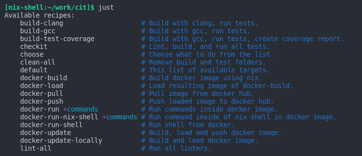
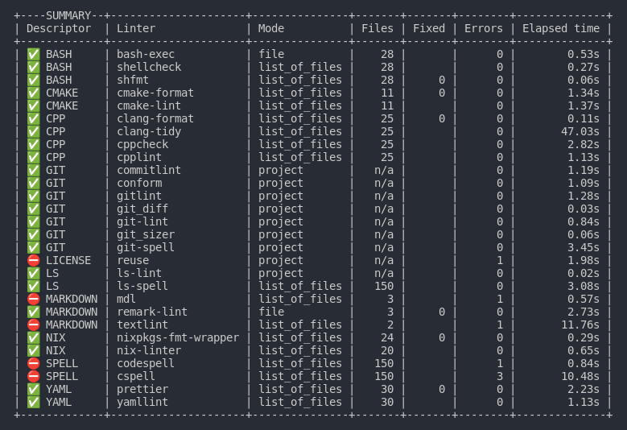
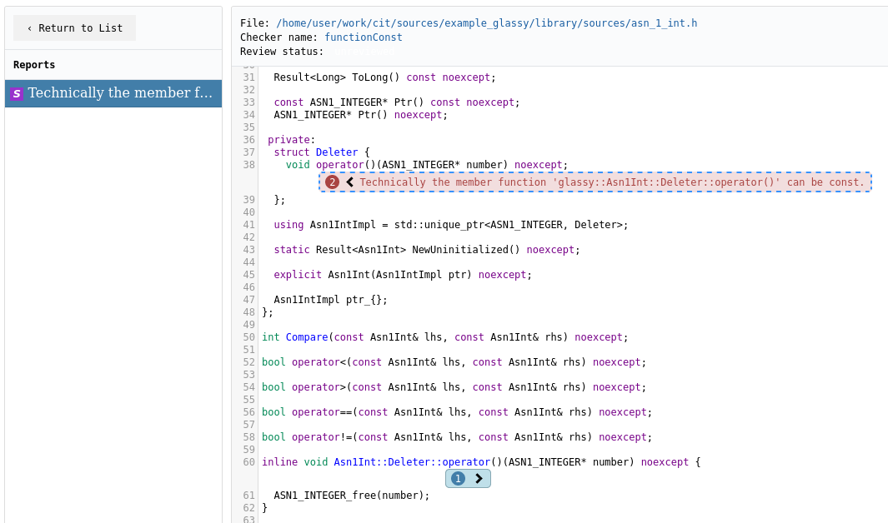
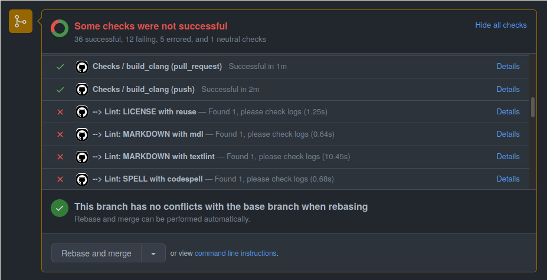
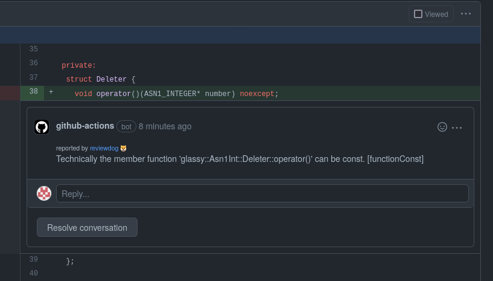
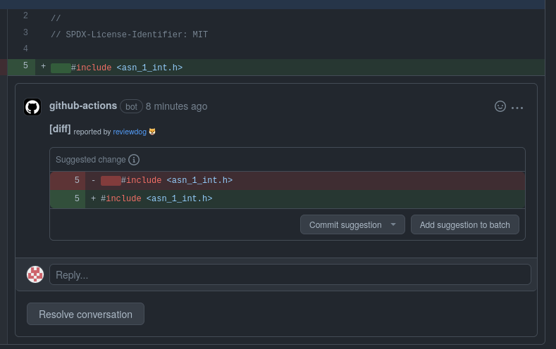
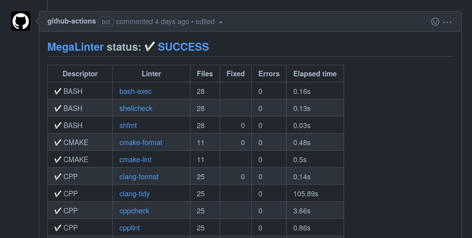
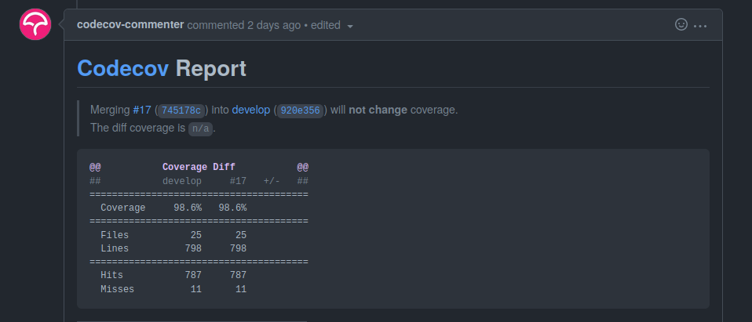
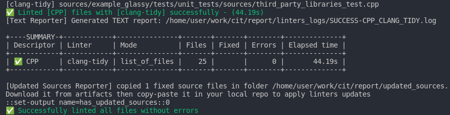

<!--
SPDX-FileCopyrightText: © 2022 Melg Eight <public.melg8@gmail.com>

SPDX-License-Identifier: MIT
-->

# Cit - Control it

[][1]
[][2]
[][5]
[][10]
[](https://github.com/melg8/cit/blob/main/license.md)
[][3]

Control your c++ code using this continuous integration template.

**cit** - is a project template for development of C++ codebase.
It aggregates linters, static and dynamic analysis tools in single,
ready to use template.

## Main goals of project

- Explore capabilities of automatic tools and their impact on development

- Give users of project unified access to linters and analysis tools

- Showcase techniques of testing different properties of codebase

- Provide reproducible builds and environments through
  [**docker**](https://www.docker.com/) and
  [**nix**](https://github.com/nix-community/awesome-nix)

- Encourage responsible attitude towards the development of quality software

## Features

- \[x] This repository provides reproducible development and testing
  environments with version pinning thanks to
  [**docker**](https://www.docker.com/) and
  [**nix**](https://github.com/nix-community/awesome-nix)

- \[x] Support of major c++ compilers, with all compile time checks enabled

- \[x] Familiar cross-platform build setup using cmake and conan

- \[x] Runtime tests with doctest and sanitizers

- \[x] Command-line [tool](https://github.com/casey/just) to simplify usage of
  functionality

  

- \[x] A lot of linters, formatters and static analysis tools integrated and
  setup for each aspect of project with informative reports thanks to
  integration with patched version of
  [megalinter](https://github.com/megalinter/megalinter)

  

- \[x] You don’t need to stare at raw logs of tools, thanks to
  [CodeChecker](https://github.com/Ericsson/codechecker) you can check summary
  tables, statistics for project and reports in your browser
  

- \[x] Even if you can’t run it locally - that’s not an issue. Ready to use
  GitHub ci setup with same checks and reports uploaded as artifacts

- \[x] Pull requests won’t pass if linters found some issues

  

- \[x] [Reviewdog](https://github.com/reviewdog/reviewdog)
  comments cpp linters output in pull request

  

- \[x] Linters suggestions and auto fixes are also displayed by reviewdog as
  suggestions in pull request

  

- \[x] Pull requests feedback with linting results as comment:
  [example](https://github.com/melg8/cit/pull/17#issuecomment-1126876938).
  When there are no issues left with pr you will see updated message from bot

  

- \[x] Code coverage with pull request Codecov reports

  

- \[x] All artifacts with logs are available for download from ci

## Current status

This project is under development, expect changes in api, setup and tools.
It uses opinionated set of rules and conventions for project,
feel free to change configuration files to best fit your personal needs.
You can fork and play with it, contributions to the source code,
issues and requests are welcome.

## Getting Started

You can use this template in different levels of integration with user
environment. From using text editor and running all checks in CI, up to
using prepared docker image or nix-shell and running check locally.

1. Fork this project, enable GitHub actions and edit it either with
   GitHub editor or with local text editor

1. Project use cmake ninja and conan. If you have them installed on your system
   you can build and run tests as with any other cmake project. Or run this
   bash script from root of project to build project with gcc:

   ```bash
      ci/builders/gcc/build.sh
   ```

1. To use this project locally to the full potential you have options:

- Install docker than you can use prepared docker image. Call this script
  from root of project to run bash shell inside docker image

  ```bash
     ci/docker/run_shell.sh
  ```

- Install nix package manager or use nixos. In that case call nix-shell

  ```bash
     nix-shell
  ```

## Usage

Okay. You got your environment either with docker image or with nix-shell,
let’s take a look what’s next.
To ease usage of project we use [just](https://github.com/casey/just).
So we can call it like that:

```bash
   just
```

You will see available recipes (actions) which you can do to use project:


Let’s explore main functions.
You can build project with gcc or clang compiler using commands:

```bash
   just build-gcc
```

```bash
   just build-clang
```

To run all linters on your project use:

```bash
   just lint-all
```

To run specific linter on your project use lint-with command with name of
descriptor and linter all capital case split by underscores. So if we want
to run clang-tidy from CPP descriptor we call:

```bash
   just lint-with CPP_CLANG_TIDY
```

And we will see report of single linter:



After linting you can check report folder with all logs from linters.

From nix-shell or docker image you can also build docker image yourself.
[Nix](https://github.com/nixos/nix) used to reproducibly build
tar archive with docker image containing all linters

```bash
   just docker-build
```

You can check that produced result has same hash sum as result
produced by ci:

```bash
   sha256sum result
```

Docker image than loaded from result:

```bash
   just docker-load
```

Or you can run docker-update-locally to do image creation, sha256sum and load
in single command:

```bash
   just docker-update-locally
```

Docker-update command will build image and upload it to docker-hub:

```bash
   just docker-update
```

To see all inner workings take a look in [justfile](justfile) for concrete
bash scripts for each action. Check
[GitHub workflows](.github/workflows/checks.yml) file for GitHub ci setup.

## Available tools

- **online services**
  - [GitHub actions][6] - check/build/run tests
  - [Codecov][7] - verify code coverage of tests
  - [lgtm](https://lgtm.com/) - build and analyze source code
  - [dependabot][8] - check dependencies

- **unified console commands**
  - [just](https://github.com/casey/just) - CC0 1.0 Universal

- **git**
  - [git](https://github.com/git/git) - GPLv2,LGPLv2.1
  - [git-sizer](https://github.com/github/git-sizer) - MIT
  - [conform](https://github.com/talos-systems/conform) - MPL2.0
  - [commitlint](https://github.com/conventional-changelog/commitlint) - MIT
  - [gitlint](https://github.com/jorisroovers/gitlint) - MIT
  - [git-lint](https://github.com/bkuhlmann/git-lint) - Apache 2.0
  - [gitleaks](https://github.com/zricethezav/gitleaks) - MIT

- **licenses**
  - [reuse](https://github.com/fsfe/reuse-tool) - Apache-2.0

- **files and directories**
  - [ls-lint](https://github.com/loeffel-io/ls-lint) - MIT

- **spelling**
  - [cspell](https://github.com/streetsidesoftware/cspell) - MIT
  - [codespell](https://github.com/codespell-project/codespell) - GPLv.2.0

- **cpp static analysis**
  - [clang](https://clang.llvm.org/) - warnings as errors checks - Apache 2.0
  - [clang-format](https://clang.llvm.org/docs/ClangFormat.html) - NCSA
  - [clang-tidy](https://clang.llvm.org/extra/clang-tidy) - NCSA
  - [cppcheck](https://github.com/danmar/cppcheck) - GPLv3.0
  - [cpplint](https://github.com/cpplint/cpplint) - BSD 3-clause
  - [gcc](https://gcc.gnu.org/) - warnings as errors checks - GPLv3.0

- **cpp dynamic analysis**
  - [clang](https://clang.llvm.org/) - sanitizers - Apache 2.0
  - [gcc](https://gcc.gnu.org/) - sanitizers - GPLv3.0
  - [grcov](https://github.com/mozilla/grcov) - code coverage - MPL-2.0

- **cpp examples of library usage**
  - [doctest](https://github.com/doctest/doctest) - MIT
  - [outcome](https://github.com/ned14/outcome) - Apache-2.0

- **cmake**
  - [cmake-format](https://github.com/cheshirekow/cmake_format) GPLv3.0
  - [cmake-lint](https://github.com/cheshirekow/cmake_format) GPLv3.0

- **shell**
  - [shellcheck](https://github.com/koalaman/shellcheck) - GPLv3.0

- **nix**
  - [nixpkgs-fmt](https://github.com/nix-community/nixpkgs-fmt) - Apache-2.0
  - [nix-linter](https://github.com/Synthetica9/nix-linter) - BSD 3-clause
  - [nix-shell][4] - LGPL-2.1 License

- **md files**
  - [remark](https://github.com/remarkjs/remark) - MIT
  - [textlint](https://github.com/textlint/textlint) - MIT

- **yaml**
  - [yamllint](https://github.com/adrienverge/yamllint) - GPLv3.0

## Planned

- **cpp tools**
  - [jscpd](https://github.com/kucherenko/jscpd) - MIT
  - [valgrind](https://valgrind.org/) - GPLv2.0
  - [libFuzzer](https://llvm.org/docs/LibFuzzer.html) - NCSA
  - [doxygen](https://github.com/doxygen/doxygen) - GPLv2.0
  - [standardese](https://github.com/standardese/standardese) - MIT
  - [mull](https://github.com/mull-project/mull) - Apache-2.0
  - [mutate_cpp](https://github.com/nlohmann/mutate_cpp) - MIT
  - [rapidcheck](https://github.com/emil-e/rapidcheck) - BSD-2-Clause
  - [clazy](https://github.com/KDE/clazy) - LGPLv2
  - [infer](https://github.com/facebook/infer) - MIT
  - [pvs studio](https://pvs-studio.com/en/pvs-studio/)

- **cpp compilers**
  - [msvc](https://docs.microsoft.com/en-us/cpp/?view=msvc-170) - Microsoft EULA
  - [MinGW](https://www.mingw-w64.org/) - GNU GPL

- **ci environments**
  - MacOS
  - Windows

- **examples of library usage**
  - [qt6](https://www.qt.io/product/qt6)
  - [openssl](https://github.com/openssl/openssl) - Apache-2.0
  - [gsl-lite](https://github.com/gsl-lite/gsl-lite) - MIT

- **gui testing**
  - [SikuliX1](https://github.com/RaiMan/SikuliX1) - MIT

- **reproducible builds testing**
  - [sha256sum](https://github.com/coreutils/coreutils) - GPL-3.0

- **unified console commands**
  - [husky](https://github.com/typicode/husky) - MIT

- **approval testing**
  - [ApprovalTests.cpp][9] - Apache-2.0

- **microbenchmarking**

- **compile time benchmarking**

- **wiki about project**

- **logo and illustrations**

- **stable release versions and tags**

- **roadmap**

## Credits

Big thanks to contributors. You can see contributors in [credits](credits.md).

## License

**cit** template released under the terms of the MIT license.
See [license](license.md) for more information.

[1]: https://github.com/melg8/cit/actions/workflows/checks.yml

[2]: https://codecov.io/gh/melg8/cit

[3]: https://builtwithnix.org

[4]: https://nixos.org/manual/nix/unstable/command-ref/nix-shell.html

[5]: https://lgtm.com/projects/g/melg8/cit/context:cpp

[6]: https://github.com/melg8/cit/actions

[7]: https://app.codecov.io/gh/melg8/cit

[8]: https://github.com/dependabot/dependabot-core

[9]: https://github.com/approvals/ApprovalTests.cpp

[10]: https://api.reuse.software/info/github.com/melg8/cit
